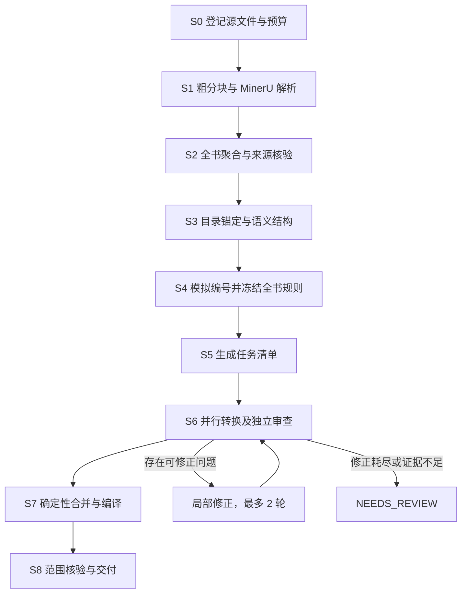

# BookAnalyst 严格工作流 v0.4

更新：2026-09-05。本文定义执行顺序、数据契约、通过条件与失败路径。配套 [执行契约](workflow.contract.json) 固定阶段、成员职责、状态和默认预算；首版执行器已实现，实际覆盖与尚未补齐的契约见 [实现状态](implementation.md)。

## 1. 执行模型

每次运行绑定一个 PDF、明确的处理范围、解析配置和预算。阶段按 S0 → S1 → S2 → S3 → S4 → S5 → S6 → S7 → S8 执行；仅前置阶段 PASSED 后允许启动后续阶段。测试模式可在指定阶段结束，并记录 TEST_COMPLETED。



阶段状态只能按执行契约转换。NEEDS_REVIEW 必须附问题、来源与候选；补充证据或明确处理决定后建立新修订并回到 PENDING。FAILED 必须修复原因后才能重启。任何重启均沿用累计预算，增加预算必须形成新的配置修订。PASSED 产物不覆盖修改；输入变化使对应阶段及下游 STALE。运行中的旧任务可以结束，但返回结果只能归档，不能进入新修订。

### 参与成员与权限

执行成员分为程序、MinerU、LLM 三类。LLM 再分为以下四个逻辑角色；角色可绑定同一模型，也可分别配置模型，角色数量不等于并发请求数。

| 成员 ID | 成员 | 负责产物或动作 | 权限边界 |
| --- | --- | --- | --- |
| PROGRAM | 程序 | 分页、接口调用、账本、归一化、规则模拟、任务调度、TeX 渲染、编译、检查与提交 | 唯一可以修改运行状态、冻结配置、提交正式产物的成员 |
| MINERU | MinerU | 从 PDF 分块提取原始 JSON、公式、版面与图片资源 | 只负责文档解析；不决定全书计数器和最终 TeX 结构 |
| LLM_ANALYST | 分析 LLM | 内容取舍、跨页续接、标题与数学结构、编号规则候选、引用消歧 | 提交带来源的结构化建议；不能直接改正式内容或冻结规则 |
| LLM_CONVERTER | 转换 LLM | 在任务所有权内生成 TeX 片段，按问题清单局部修正 | 遵守全书配置；不能改计数器、公共宏或任务范围 |
| LLM_REVIEWER | 审查 LLM | 对照来源独立审查语义、转换结果及跨任务边界 | 提交问题及审查结论；不能直接标记阶段通过 |
| LLM_VISUAL_REVIEWER | 多模态核对 LLM | 独立读取原页图像，核对 MinerU 解析与视觉读数，定位差异与遗漏 | 必须具备图像输入能力；提交证据和建议，不能直接覆盖正式内容 |

**每一步交接都由程序执行。** 下文步骤标注的箭头表示交接顺序：例如“分析 LLM → 审查 LLM → 程序”表示分析提交候选，程序校验并转交独立审查，程序再依据检查结果提交或阻断。LLM 之间不直接修改对方产物。

程序能够核验来源、结构、编号和格式等确定性条件；数学语义等判断必须具备独立审查报告。程序拥有状态提交权，并不意味着程序可以独立判断数学内容正确。LLM 的自我评价不能代替独立审查。

| 阶段 | 程序 | MinerU | LLM |
| --- | --- | --- | --- |
| S0 登记 | 文件与范围检查、配置和预算登记 | — | — |
| S1 解析 | 拆分、提交、轮询、下载、核验 | PDF 内容与版面解析，生成原始结果 | — |
| S2 聚合 | 归一化、来源映射、原页渲染、候选检测、应用已审查变更 | — | 一次判断各 box type 是否保留；多模态模型核对原图与解析 |
| S3 结构 | 目录精确匹配、结构与覆盖校验 | — | 分析并审查标题、数学单元和歧义 |
| S4 全书设置 | 枚举并模拟计数规则、引用建表、配置冻结 | — | 提出规则候选，解释并审查例外与引用歧义 |
| S5 分块 | 预算计算、所有权分配、任务生成 | — | 仅在语义边界不明确时分析与审查 |
| S6 转换 | 派发、格式与来源检查、重试和结果管理 | — | 转换、独立内容审查、边界审查、局部修正 |
| S7 合并 | 统一渲染、调用编译器、全书检查 | — | 出错时退回对应阶段，不在合并器中自由改写 |
| S8 验收 | 核验已有证据，生成报告与最终清单 | — | — |

每次 LLM 请求必须记录 role、model_id、prompt_version、input_hash 和 request_id。分析与转换结果若涉及语义决策，必须经过独立审查上下文；程序负责在每次交接时验证契约。阶段内同一角色可批量处理多个问题，避免把文档中的每一步机械地变成一次请求。

所有角色请求共用 llm_concurrency 与累计 LLM 请求预算；可以配置 analyst_model、converter_model、reviewer_model、visual_reviewer_model。需要回看原图时，接收图像的 LLM 必须支持图像输入；纯文本模型不能仅凭 JSON 声称已完成图像核对。无法自动取得足够证据时进入 NEEDS_REVIEW，由人工提供证据或明确处理决定；人工不是正常阶段的必经审批成员。

### 用真实文档改进工作流的边界

测试文档用于发现失败，不向核心代码注入书名、页码、定理编号或预期正文答案。原始解析与已提交产物不手工覆盖；内容修正必须经过正式的证据、校验和独立审查路径。程序可以检测异常和核对契约，不能凭标点、字符出现位置或测试经验猜测数学含义。

- 同名同号节点不能靠标题是否带括号自动确定引用目标；缺少唯一目标时保留歧义，交回结构分析补充证据。
- S2 在执行全书 type 过滤后检测正文中的异常控制字符，记录来源 ID、位置和码位。启用视觉核对时自动加入对应原图核对范围；页索引仅用于取证，不改变 block 集群处理方式。程序不为异常字符指定替代符号。
- 禁用视觉核对，或核对后异常仍存在时，S2 不通过。TeX 渲染也拒绝未解决的异常，防止旧检查点绕过检查。
- 程序回归测试只验证这些约束和错误路径。真实 PDF → TeX 的可行性仍以真实服务运行、内容审查和编译验收为依据。

### 数据提交规则

- 每阶段输出包含 schema_version、run_id、revision、input_hashes、producer_version、gate_results；程序汇总 actor_reports，记录每个成员的角色、输入哈希与报告引用。
- 先写临时目录，校验结构和哈希，再原子提交产物清单并标记 PASSED。进程中断留下的临时文件不参与后续运行。
- 跨运行导入缓存必须核对源文件、范围及配置哈希，记录 imported_from_run；样本结果不能充当全书前置阶段。
- 原始 PDF、MinerU 输出和已通过的修订不可变。校正写成带来源和理由的增量记录。
- 账本对每次调用先预占额度，再派发；失败与超时也计入调用预算。断点恢复不重置计数。
- API token 仅通过本地配置引用注入，不进入运行清单、提示词、日志或交付产物。

## 2. 公共对象与内容守恒

| 对象 | 必填数据与用途 |
| --- | --- |
| source | PDF 哈希、总页数、范围内物理页索引、scope；物理索引统一从 0 开始 |
| raw_block | raw_id、解析修订、分块 ID、全局页索引、块序号、原文、原始类型、资源引用 |
| atom | atom_id、来源块及字符／资源范围、全书顺序、类型、原始载荷；表示不可重复输出的最小内容单位 |
| semantic_node | node_id、节点类型、父节点、按序排列的子节点或 atom_id、作者原始标题／编号 |
| task | task_id、owned_atom_ids、context_atom_ids、父环境路径、边界关系、配置哈希、输入输出预算 |
| fragment | task_id、输入哈希、对应原子的输出节点、变更记录、疑点 |
| finding | finding_id、阶段、来源 ID、问题类型、证据、阻断级别、处理结果 |
| image_evidence | source_sha256、page_idx、原页区域、旋转与分辨率、image_sha256；记录实际送入模型的原始图像 |
| visual_review | 图像证据、视觉读数、解析片段、差异、核对覆盖范围及处理结果 |

raw_id 由源文件、解析修订和块位置确定；atom_id 在同一归一化修订内稳定。重新解析不得按旧序号盲目复用结果。

所有原始块必须在 dispositions.json 中登记为 KEEP、EXCLUDE 或 MERGE，并提供去向；MERGE 记录全部来源，EXCLUDE 记录具体理由。对于重复页眉等被排除内容保留原始记录，不生成正文。

设 R 为最终需要输出到正文的原子集合，O(t) 为任务 t 的所有权集合，必须满足：

```text
所有任务 O(t) 的并集 = R
任意不同任务的 O(t) 交集 = 空集
每个正文 atom_id 在最终输出映射中出现且仅出现一次
context_atom_ids 不赋予输出所有权
```

文本原子保留字符范围，公式保留 TeX 载荷及来源，图表保留资源与说明。拆分文本时字符范围必须连续、无重叠、无缺口；单个公式不能从中截断。对内容的修改必须通过变更记录核验，来源 ID 覆盖不能替代内容比对。

### 原始 PDF 图像核对

新增 LLM_VISUAL_REVIEWER（多模态核对 LLM），只负责对照原始 PDF 图像核验内容，可与其他角色使用同一模型，但使用独立上下文。它必须具备已确认的图像输入能力；模型选择由运行参数 visual_reviewer_model 指定，供应商登录和 API 参数仍只在独立接入层配置。

| 执行者 | 操作 | 输出 |
| --- | --- | --- |
| 程序 | 从原始 PDF 渲染完整页面，必要时裁剪、放大并附相邻页；绑定原文件哈希和坐标 | 图像证据包 |
| 多模态核对 LLM | 先只看图像与核对范围，独立识别文字、公式和内容区域 | 视觉识别记录 |
| 程序 | 保存视觉记录，组织原图、对应 MinerU 原始块及规范内容 | 对照请求 |
| 多模态核对 LLM | 在新的上下文中逐项比较原图、视觉记录与解析结果 | 一致项、差异、遗漏区域及修正建议 |
| 程序 | 校验报告的来源与覆盖范围，应用有证据的局部修正或退回对应阶段 | 审查记录与新内容修订 |

**图像必须来自原始 PDF。** 不使用由 MinerU 文本或生成的 TeX 重新排出的图片作为原始证据。页面图像保留版面只是为了定位与核对，坐标和分页不进入最终正文。

程序保存 source_sha256、page_idx、页面旋转、PDF 坐标区域、渲染分辨率和 image_sha256。默认整页 150 DPI，小字或公式必要时直接从原 PDF 以 300 DPI 渲染局部，并保留整页上下文。超出模型图像尺寸或数量限制时由程序拆分核对范围，记录精确覆盖，不静默压缩到无法识别。

两次模型调用都计入全局 LLM 并发和请求预算。第一次不传入 MinerU 文本，避免视觉读取直接照抄解析结果；第二次传入原图和两份读数，要求依据图像解释差异。存在源图清晰度疑点时最多补充一轮更高分辨率／更完整上下文的读取和对照；同一证据不循环重审。

每条差异必须记录：review_id、source_ids、page_idx、region_id、解析文本、视觉读数、差异类型、证据说明、建议修正。MinerU 完全遗漏的区域允许 source_ids 为空，但必须提供原页位置和可见内容；程序将其作为解析缺失退回 S1，不凭空构造 MinerU 来源 ID。

| 对照结果 | 处理 |
| --- | --- |
| MATCH | 保留解析内容，记录实际核对的区域 |
| MISMATCH | 区分符号／上下标、正文、公式、遗漏、重复、顺序或边界差异；修正识别错误时建立 S2 新修订，遗漏区域退回 S1 |
| SOURCE_UNREADABLE | 补充原始图像证据后仍无法辨认，保留原文和具体模糊位置，进入 NEEDS_REVIEW |
| REVIEW_INCONCLUSIVE | 原图可用，但模型读数冲突或证据不足以解释差异，记录核对失败，进入 NEEDS_REVIEW |

视觉读数本身也可能出错，不能直接覆盖 MinerU 结果。程序只接受有明确原图依据、精确对应位置和 before／after 记录的局部修正；数学论断的合理性不能作为改写原文的理由。成功应用的修正关联原差异与新内容哈希；修订后的范围需要再次通过对照，不跳过复核。

visual_review 支持 targeted（针对疑点）、sampled（指定样本）和 full（全部目标页）。运行开始时冻结 visual_review/plan.json，记录目标页／区域和预算；后续新增疑点需要计划修订。完整页识别需同时检查 MinerU 框外是否有遗漏内容；只核对已有框内文字不能证明整页内容齐全。

禁用视觉核对或目标为空时仍写入计划和报告，分别标记 DISABLED 或 NO_TARGETS，实际核对数为 0；这两种状态不能作为已核对原图的证据。llm_smoke 的指定图像用例必须实际完成，不能以空目标通过。

图像独立读数与图像／解析比较分别保存按输入哈希寻址的检查点。原图和模型未变化时，可在恢复时复用独立读数；解析内容修订后，受影响范围的比较必须重新执行。检查点内容哈希异常时阻断，不能作为已通过证据。

核对结果写入 visual_review/index.json，记录 planned_regions、completed_regions、unresolved_regions、mode、evidence_origin 和内容修订哈希。完整页核对与局部裁剪核对分别计数；只有目标源范围全部完成且无未解决差异时，才可声明原 PDF 完整核对完成。模型支持图像和真正完成图像核对是两个独立事实。


## 3. 阶段执行规程

### S0：登记源文件与运行预算

**成员分工：** 程序独立执行。 正式状态和产物统一由程序提交。

**输入：** PDF、运行模式、服务配置。**输出：** run.json、source.json。

1. **【程序】** 计算文件哈希，检查文件可读、加密状态、页数及处理范围。
2. **【程序】** 选择 MinerU 线上 API 或本地适配器，登记已确认的服务地址、鉴权引用、页数／字节限制和解析版本。
3. **【程序】** 冻结并发、超时、重试、调用与累计处理页数预算。需要调用 LLM 时必须提供模型上下文上限和输出上限；启用原图核对时还必须确认所选模型及适配器支持 text + image，并登记核对模式和图像预算。
4. **【程序】** 写入范围：full、sample 或 fixture；后续产物继承该范围。

offline_fixture 模式使用显式 fixture 适配器和已知输入输出，不要求线上凭据或服务探活；依然执行相同范围与哈希核验。

**G00：** 配置完整且范围有效才通过。缺失配置进入 NEEDS_REVIEW；文件不可读或服务鉴权失败进入 FAILED。此阶段不上传文件。

### S1：粗分块与 MinerU 解析

**成员分工：** 程序拆分、提交、轮询、下载与核验；MinerU 执行 PDF 版面、文本、公式和图表解析。 正式状态和产物统一由程序提交。

**输入：** run.json、source.json。**输出：** chunks.json、raw/index.json 及原始结果、资源。

1. **【程序】** 按页数上限生成连续且不重叠的 PDF 子文件；计算子文件实际字节数，超限则递归缩小页数，直到满足双重限制。单页仍超限时停止该块。
2. **【程序】** 对每块登记 chunk_id、全局物理页索引序列、文件哈希、调用状态及服务任务 ID。目标页集合必须完整覆盖一次。
3. **【程序 → MinerU → 程序】** 程序核验预算后提交；MinerU 执行版面识别、文字／公式／图表提取并生成原始结果。程序保存服务任务 ID，之后只轮询该任务。提交结果未知时先查询既有任务；无法确认则 NEEDS_REVIEW，不盲目重新上传。
4. **【程序】** 成功后下载完整结果，校验 JSON、页数及图片引用；将服务内部页索引映射回原 PDF。
5. **【程序】** 失败块按错误规则单独恢复，已成功块按输入与解析配置哈希复用。

**G10：** 页集合精确覆盖，所有实际文件满足限制。**G11：** 每块状态成功，结果和资源完整。HTTP 请求成功或服务返回“处理中”均不能通过 G11。

### S2：聚合、归一化与来源核验

**成员分工：** 程序聚合 JSON、分配 ID、检查映射；分析 LLM 一次决定全部 box type 的保留规则，程序统一应用，不逐块审查页眉或页码。结构及数学环境续接在 S3 核验。 正式状态和产物统一由程序提交。

**输入：** 所有解析块、原始 PDF 与 source.json。**输出：** type_inventory.json、type_policy.json、content.json、source_map.json、dispositions.json、visual_review/plan.json、visual_review/index.json。

1. **【程序】** 由版本适配器读取线上或本地 JSON；保留原始字段，转换到公共对象。图片统一寻址并按内容哈希去重，说明与引用仍保留各自归属。
2. **【程序】** 按全局物理页索引和 MinerU 阅读顺序聚合；位置用于定位与复核，不直接生成 TeX 布局命令。
3. **【程序 → 分析 LLM → 程序】** 程序列出全部 box type 与数量；LLM 一次性返回各类型的 KEEP／EXCLUDE 规则；程序校验每个类型恰好出现一次，再统一处理所有 box。页眉、页码不再逐块送审。可能含正文的混合类型和用途不明确的类型保留；脚注、旁注、公式编号、图表说明不能按位置或 discarded 标记直接排除。规则与类型清单保存并按输入哈希复用。
4. **【程序】** 保存各粗分块边界前后来源和 MinerU 阅读顺序，不根据封面或正文坐标重排内容。跨块段落、公式与数学环境续接交给 S3 的结构分析及独立审查，不能在取舍阶段提前推断或合并。
5. **【程序】** 检测空白解析页、缺失资源和异常符号等候选，连同待核对样本登记入视觉计划。是否为真正空白页由原图核对确定；不能仅因 JSON 为空而跳过。
6. **【程序 → 多模态核对 LLM → 程序 → 多模态核对 LLM → 程序】** 按视觉计划渲染原页，执行独立图像识别与图像对照。疑似符号识别错误以原图为依据定点修正并复核；完全遗漏的内容退回 S1。输出图像证据、视觉读数、差异与覆盖报告，遵守本文件的原始 PDF 图像核对规程。

**G20：** 每个原始块有去向，原子与来源映射合法。**G21：** 来源阅读顺序与边界映射完整，所有排除决定有明确依据；已保守保留的未知项不会仅因取舍不确定而阻断，后续结构和原图核对仍须执行。**G22：** 视觉计划中的目标已核对、证据与内容修订匹配、差异已处理；目标为空或只核对局部时如实记录范围，不声明整页／整书已核对。解析缺失退回 S1，归一化问题在 S2 修订。

### S3：目录锚定、标题树与数学单元识别

**成员分工：** 程序提取候选并做精确匹配；分析 LLM 恢复标题与数学单元结构，审查 LLM 复核语义，程序保存结构树。 正式状态和产物统一由程序提交。

**输入：** content.json、source_map.json。**输出：** toc.json、structure.json、number_observations.json。

1. **【程序 → 分析 LLM → 审查 LLM → 程序】**（LLM 仅在目录条目需要语义重组时调用） 提取目录条目，保存原始标题、编号、层级、印刷页码与来源。只规范化匹配用的空白和换行，不改写数学符号。
2. **【程序】** 按目录顺序寻找正文候选：优先匹配“规范化标题 + 原编号”；印刷页码仅辅助定位，不假设全书只有一个页码偏移。
3. **【分析 LLM → 审查 LLM → 程序】**（LLM 仅在精确匹配产生冲突或缺项时调用） 唯一匹配后建立锚点。模糊匹配、多重匹配、缺项或层级冲突产生 finding，必须回查目录与正文并解决。
4. **【分析 LLM → 审查 LLM → 程序】** 正文未收录于目录的小标题在相邻锚点间识别，并验证父子关系。在 structure.json 中将目录原子标记为 evidence_only 并关联标题树，正文原子标记为 body；目录内容保留为结构证据，最终目录由标题树生成。任务所有权仅覆盖 body 原子。
5. **【分析 LLM → 审查 LLM → 程序】** 标注定义、定理、引理、命题、证明、例题、习题、公式及其他语义单元；建立跨页父子和续接关系。保留每次作者编号的原始文本。
6. **【分析 LLM → 审查 LLM → 程序】**（LLM 仅在原书缺少可用目录时调用） 无目录时，明确记录 toc_mode=body_reconstructed，依据正文建立替代标题树并审查；不能标记为“目录已校验”。

**整书增量执行：** 程序按模型输入及输出预算组织连续 block 集群，不将整本 JSON 塞进一次请求。每批携带已确认的标题／数学环境路径、紧邻节点和前后来源上下文；分析 LLM 必须给出完整的传出路径及段落／公式续接证据，独立审查 LLM 核对本批所有权和两侧边界。程序依次合并，拒绝续接到非相邻节点或重新进入已经关闭的父环境。目录及前向引用待全书索引建立后统一消歧。每个通过的批次按输入、模型和契约版本保存检查点，恢复时先验证再复用。

**G30：** 所有目录条目有唯一匹配或经证据支持的处理记录，标题树无循环且顺序一致。**G31：** 每个正文原子属于唯一叶节点，证据原子有明确去向，边界无悬空，编号观察有关联来源。歧义进入 NEEDS_REVIEW，不能依靠模型置信度跳过。

### S4：计数器分析与全书规则冻结

**成员分工：** 分析 LLM 提出作者规则及例外解释；程序枚举、模拟全部编号并冻结配置；审查 LLM 复核有语义判断的规则与引用。 正式状态和产物统一由程序提交。

**输入：** 标题树、语义单元、全部编号观察。**输出：** book_profile.json、numbering_ledger.json、reference_registry.json。

1. **【程序】** 按编号出现顺序建立账本：对象 ID、环境类型、章节路径、作者编号、是否编号、引用指向。
2. **【分析 LLM → 审查 LLM → 程序】** 枚举与样本一致的候选规则：计数器独立／共享、全书／章／节重置、编号前缀、附录规则。样本用于缩小候选，最终必须检查范围内全部观察。
3. **【程序】** 用每条候选规则模拟整条编号账本；逐项比对渲染编号与作者编号，覆盖重置边界、交错环境、无编号对象及附录。
4. **【程序】** 只有唯一成立的规则才能直接冻结。多个候选无法区分时记录歧义；没有候选通过时回查识别、分类或作者特殊编号。
5. **【分析 LLM → 审查 LLM → 程序】**（LLM 仅在计数器模拟发现作者特殊编号候选时调用） 作者确有跳号、后缀或其他例外时，登记 exception_id、对象、来源和显式编号；由公共渲染器处理，不能修改作者编号来迎合计数器。
6. **【程序 → 分析 LLM → 审查 LLM → 程序】**（LLM 仅在引用不能由已确认对象标识唯一匹配时调用） 建立全书唯一标签和引用映射。同名编号按章节及对象类型消歧；外部文献引用独立登记。无法确定的内部引用保持阻断。
7. **【程序】** 固定一套环境与宏配置，冻结为 profile_hash；所有任务携带该哈希。

**G40：** 每个观察值均能由规则或有证据的例外复现，歧义已解决。**G41：** 配置冻结，标签唯一，内部引用可解析。后续任务不能新建计数器、修改全书编号或自行定义宏。

### S5：语义任务规划

**成员分工：** 程序按既定语义树计算预算和分配所有权；仅边界不明确时调用分析与审查 LLM。 正式状态和产物统一由程序提交。

**输入：** content.json、structure.json、冻结配置与引用表。**输出：** tasks.json。

1. **【程序】** 按正文顺序优先打包完整小节、定义、定理及证明、连续推导。目录锚点约束标题归属；物理分页不决定任务边界。
2. **【程序】** 同时检查生成与审查预算：输入 token + 预留输出 token + 安全余量 ≤ 模型上下文上限。默认安全余量为上限的 10%；按真实序列化请求计数，无法准确计数时采用保守估算并记录。
3. **【程序 → 分析 LLM → 审查 LLM → 程序】**（LLM 仅在超预算且已标注的段落／公式边界不足以确定合法拆分时调用） 超预算时按语义子单元拆分。超长证明在段落或完整公式之间拆分，记录共同父环境、续接边及相邻上下文。单个原子仍超限则 NEEDS_REVIEW，禁止截断。
4. **【程序】** 给每个任务分配 owned_atom_ids；上下文只读。任务返回父环境中的内容片段，环境开闭由最终渲染器根据结构树统一处理。
5. **【程序】** 任务键包含来源哈希、profile_hash、任务配置、模型和提示词版本。

**G50：** 所有权满足内容守恒公式。**G51：** 生成与审查预算均合规，所有续接边明确。超预算只重新规划相关子树，规划变化使对应旧任务过期。

### S6：并行转换、检查与局部修正

**成员分工：** 程序派发、检查和管理状态；转换 LLM 生成／修正片段；审查 LLM 独立核对内容和跨任务边界。 正式状态和产物统一由程序提交。

**输入：** 任务清单、原始内容、冻结配置。**输出：** fragments/index.json、reviews/index.json 及各片段、报告。

任务状态：

```text
PENDING → RUNNING → CANDIDATE → CHECKING → PASSED
                                   ↓
                            REPAIR_PENDING → RUNNING
                                   ↓ 超出 2 轮或证据不足
                              NEEDS_REVIEW
```

1. **【程序】** 全局信号量控制 llm_concurrency，默认 2，允许任意正整数；同一模型可处理多个任务。结构分析、生成、审查和修正的 LLM 请求共用该上限，MinerU 并发独立且默认 1。
2. **【转换 LLM】** 模型只输出带来源 ID 的结构化转换结果。普通文字、图表资源优先直接引用原子；TeX 生成集中于数学片段和必要转义。禁止概括正文、补写论证或按知识“修正”原书结论。
3. **【程序】** 固定输出契约如下：输出节点按所有权顺序覆盖所有原子，复制节点使用 source_ref；数学节点可给出 latex；变更必须有 before、after、来源和理由。拒绝额外导言区、未知字段和越权来源。

```json
{
  "task_id": "task-001",
  "profile_hash": "<sha256>",
  "input_hash": "<sha256>",
  "nodes": [
    {"atom_id": "a-001", "kind": "source_ref"},
    {"atom_id": "a-002", "kind": "math", "latex": "x^2+y^2"}
  ],
  "changes": [],
  "findings": []
}
```

4. **【程序】** 程序先检查契约、来源覆盖、哈希、数学环境及宏白名单，再对普通文字做允许转义后的精确比对。公式默认保持原始载荷；变化必须记录，不能通过简单删除反斜线或所有空白来判等。
5. **【审查 LLM】** 独立审查请求同时读取来源、候选、配置和差异，检查遗漏、重复、条件、符号、环境和引用；不向审查者提供生成者的自我评价。可使用相同模型，但必须是独立上下文。
6. **【审查 LLM → 程序】** 相邻任务的续接边另设审查记录，每条边检查一次，并核验父环境、公式顺序和断句。该审查同样占用并发与调用预算。
7. **【程序 → 转换 LLM → 程序 → 审查 LLM → 程序】**（LLM 仅在独立审查发现可修正问题且预算允许时调用） 可修正错误最多进行 2 轮增量修正；每轮均重新执行程序检查与独立审查。结构或编号规则错误退回 S3/S4；所有受影响产物失效。
8. **【程序 → 分析 LLM → 审查 LLM → 程序】**（LLM 仅在模型错误需语义诊断或发现疑似 OCR 错误时调用） 模型截断、JSON 错误、空结果和缺少来源均不算成功。发现疑似 OCR 错误时，将具体问题交回 S2 的多模态核对任务；需要改规范内容的，在 S2 建新修订并重新核对，不能只改 TeX。
9. **【程序】** 仅当所有任务和边界审查 PASSED 时完成该阶段。任务完成顺序不影响全书顺序。使用有界 worker 队列，失败后停止派发新任务，已在途结果分别保存。通过的片段和边界审查带输入及内容哈希，恢复时复核后复用；指定任务重跑只重新生成该任务并重审相邻边界，S7／S8 仍重新执行。

**G60：** 输出契约和风格检查通过。**G61：** 变更有据，独立内容审查无阻断项。**G62：** 全部片段及边界通过，版本一致。

### S7：确定性渲染、合并与编译

**成员分工：** 程序统一渲染、合并、调用编译器并核验；内容错误路由回对应 LLM 阶段。 正式状态和产物统一由程序提交。

**输入：** 已通过片段、结构树、冻结配置和编号／引用账本。**输出：** tex/ 工程、源映射、compile_report.json。

1. **【程序】** 按结构树顺序渲染，不按任务返回顺序拼接。正文模板统一使用标准环境；章节、数学环境、标签和计数器定义只由公共渲染器生成。
2. **【程序】** 固定正文写法：行内数学 `\(...\)`；无编号独立公式 `\[...\]`；单个编号公式 equation；多行关系 align／aligned；定理类采用 amsthm，证明采用 proof。使用哪个结构由语义节点决定，不允许模型自行换一套等价风格。
3. **【程序】** 原书页码及版面位置不生成正文命令；具有数学意义的粗体、黑板粗体和矩阵结构保留。作者编号通过配置统一生成，有证据的特殊编号集中处理。
4. **【程序】** 生成唯一公共导言区；模型片段不能含 documentclass、usepackage、newtheorem、setcounter 或页面间距／分页控制。宏依赖必须来自冻结配置。
5. **【程序】** 全书重查原子覆盖、标题树、编号模拟、标签唯一性、资源及引用。转换每条源页定位式引用时记录目标；无法映射的原书“见第 X 页”进入待确认，不能直接删除。
6. **【程序】** 用固定模板和 XeLaTeX 编译，最多 3 遍；根据编译标签与编号账本核对实际输出。单块测试若使用临时计数器初值，不得将该初值写入最终正文。
7. **【程序】** 语法错误定位到来源任务局部修正；编号错误退回 S4，模板错误只重跑本阶段。缺少编译器时保留候选 TeX，状态为 FAILED（DEPENDENCY_MISSING）。

**G70：** 结构、覆盖、编号与引用一致。**G71：** 编译成功，无未定义命令、未解析引用、重复标签或未解决重编译要求。候选 TeX 不得提前标记为已验收。

### S8：范围核验与交付

**成员分工：** 程序汇总已经通过的证据、核验范围和哈希、生成验收结果。 正式状态和产物统一由程序提交。

**输入：** 阶段清单、TeX 产物与全部审查报告。**输出：** audit.json、result_manifest.json。

1. **【程序】** 重新核验全部依赖哈希、阶段通过状态、预算账本及未解决 finding 数量。
2. **【程序】** 输出覆盖统计、排除清单、正文／公式变更、标题和编号规则、审查结果、编译结果、来源映射和实际调用计数。
3. **【程序】** 声明 verification_basis=normalized_content，并记录 pdf_source_audit=none／sampled／complete 及具体回查范围；根据 visual_review/index.json 的完整页与局部区域记录计算，局部核对不能计作整页完成。块覆盖率 100% 仅说明相对规范内容无遗漏，不能证明 MinerU 已提取原书全部信息。
4. **【程序】** 完整范围通过标记 BOOK_ACCEPTED；样本标记 SAMPLE_ACCEPTED；离线夹具标记 FIXTURE_PASSED。任一阻断项未解决都不能进入这些状态。

**G80：** 阶段与哈希完整、无阻断项、范围声明准确。完整 PDF 尚未逐页核对时，报告明确保留原始解析的准确性限制。

## 4. 错误、重试与失效规则

finding 级别固定为 BLOCKER 或 NOTE。内容覆盖、数学表达、标题、编号、引用、版本或契约不一致均为 BLOCKER；NOTE 只用于不影响这些通过条件的说明。模型不能通过降低问题级别绕过检查。

| 错误 | 唯一允许的处理 |
| --- | --- |
| 鉴权、无效模型或配置 | FAILED；修改配置后重新登记，禁止原样重试 |
| 限流、临时服务错误 | 在总预算内最多重试 1 次；优先遵守 Retry-After，否则等待 5 秒 |
| 提交结果未知 | 查询已有任务；无法确认则 NEEDS_REVIEW，禁止重复提交 |
| 解析缺页、资源缺失 | 修复对应 S1 块，使其下游依赖失效 |
| 输出截断或上下文超限 | 缩小相关任务，回到 S5；预算内仍失败则停止 |
| 输出格式或内容错误 | S6 局部修正，最多 2 轮，每轮重新审查 |
| 数学语义或作者规则不确定 | NEEDS_REVIEW，记录原页证据与候选，不自行补全 |
| 总预算耗尽 | FAILED（BUDGET_EXHAUSTED）；保留已通过结果 |
| 输入、规则或版本变化 | 根据执行契约的 invalidation 表将相关阶段置为 STALE |

只读请求可按策略重试。解析提交及付费／计量调用结果未知时不得按普通网络失败处理。轮询默认每 5 秒一次，最多 120 次且不超过解析任务 600 秒期限。LLM 单请求默认 180 秒。重试、修正及独立审查全部计入请求预算。

恢复复用键为 source_hash + stage_input_hash + profile_hash（适用时）+ producer_version。片段修正后至少重跑该片段、相邻边界、全书合并与验收；全书规则变化后重跑所有依赖任务。

## 5. 有限测试的固定执行路线

| 模式 | 输入与预算 | 执行范围 | 允许声明 |
| --- | --- | --- | --- |
| cloud_smoke | 1 份 1–3 页样本；最多 1 次解析提交；累计提交 ≤3 页 | 程序 + MinerU 完成 S0–S1，程序执行 S2 结构预检 | API 接入与解析链路通过，未通过 S2 语义审查 |
| local_smoke | 本地部署；1 页；最多 1 次解析提交 | 程序 + MinerU 完成 S0–S1，程序执行 S2 结构预检 | 部署与单页解析通过，未通过 S2 语义审查 |
| offline_fixture | 已保存或手工标注的夹具；网络关闭 | 程序运行相同检查器；MinerU 和全部 LLM 角色均由夹具回放 | 编排与检查逻辑通过，未验证在线模型质量 |
| llm_smoke | 已缓存的代表性样本；LLM 请求总数 ≤8，含分析、审查和修正 | 复用 S1 解析结果，程序与 LLM 正式完成 S2–S8 | 当前样本转换通过 |

cloud_smoke 和 local_smoke 不调用 LLM，也不开启多模态核对：S2 只执行 JSON 结构、资源、ID 和映射预检，将结果写入 s2_checks.json；S2 保持 PENDING，不生成完整的通过标记。llm_smoke 接续时必须完成内容取舍和续接审查。offline_fixture 的回放报告必须标记 evidence_origin=fixture。

llm_smoke 的多模态最小用例从已保存测试书的解析样本中明确选定 1 页，实际执行图像读取与解析对照；两次基础请求以及放大、修正和复核均包含在原有 ≤8 次 LLM 请求预算内。预算不足时保留测试进度，不伪造通过。

本机只执行部署和最小样本，不默认启用完整书籍模式。book 模式需独立设置全书预算，不自动继承测试额度。

每份夹具必须包含正确基准和预期失败条件。至少覆盖：目录标题错位、共享计数与重置、遗漏／重复原子、跨任务证明续接、错误引用、输出截断、结果未知及预算耗尽。另外覆盖视觉核对：公式上下标误识别、MinerU 框外内容遗漏、原图模糊、模型不支持图像、图像发送失败、只核对裁剪区域却声称整页通过，以及视觉读数与原图不符。失败夹具必须在对应阶段被拦截。

1–3 页样本不足以确定全书编号规则时，流程停在 NEEDS_REVIEW；编号逻辑通过明确标注的离线夹具验证，不能用小样本冒充全书校验。多次最小测试分别记录运行与累计额度，不能自动轮换样本扩大测试。

## 6. 当前落地范围与依据

当前交付为严格执行规程和 JSON 执行契约，不包含运行中的调度器。后续实现必须保持上述通过条件、预算和失效规则；改变规则需更新文档与契约版本。

MinerU 线上和本地输出由适配器处理；服务限制在接入时核实并写入 run.json，不硬编码为不可修改的常量。依据：[线上 API 文档](https://mineru.net/apiManage/docs)、[输出格式说明](https://opendatalab.github.io/MinerU/zh/reference/output_files/)。
